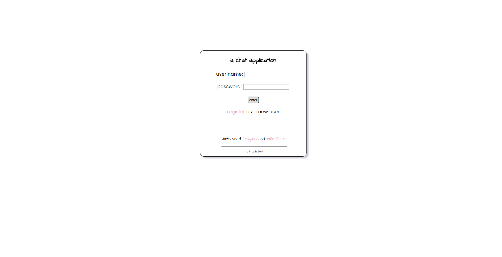
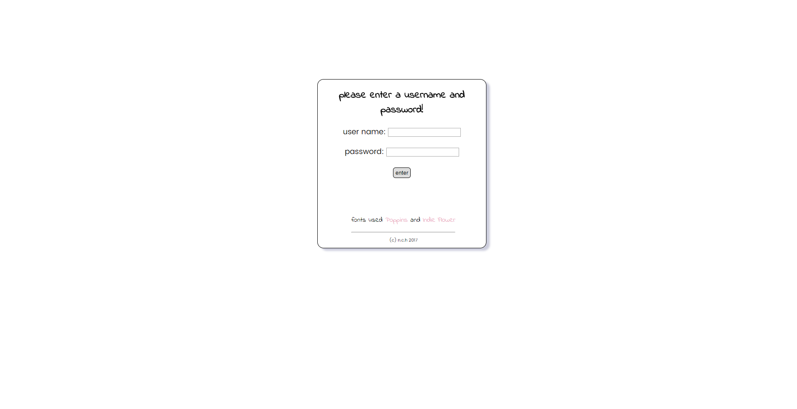
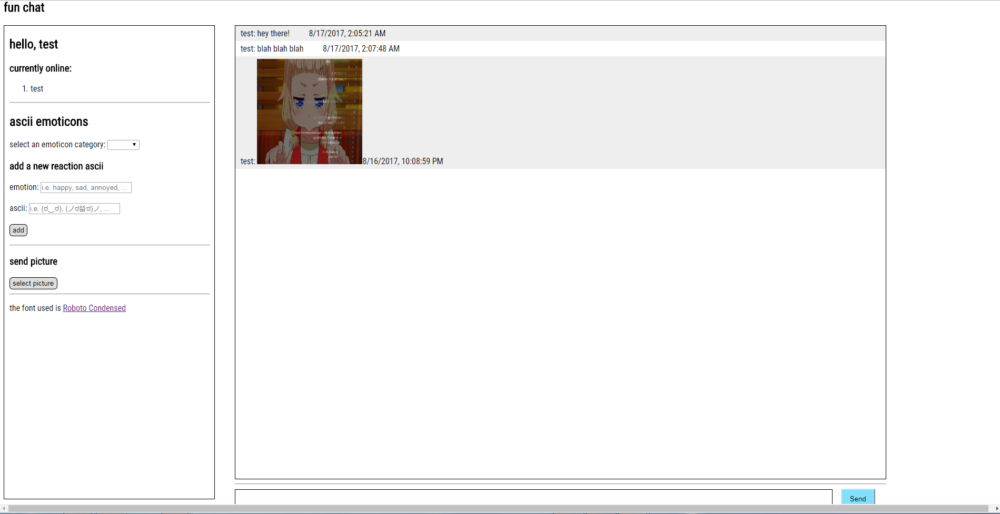

# boringChat    
a basic chat application using Node.js, Socket.IO, Express.js, MongoDB/Mongoose, ejs templates, etc.    
you can see it here: https://boring-chat.herokuapp.com/     
    
have you seen/used emoticons like these before?    
ლ(ಠ_ಠლ)    
(ﾉ◕ヮ◕)ﾉ*    
(☉_☉)    

They're fun to use when chatting, but difficult to type out, if you can even do so, and sometimes can be a pain to find online. (╯°□°）╯︵ ┻━┻    
    
Therefore I made this application where users will be able to preset emotions (i.e. happy, angry, sad) mapped to a variety of emoticons. I know that emojis exist, but sometimes using characters to create faces is more fun and interesting.     
    
Also, with this application, you won't have to keep searching online for a particular emoticon (which can be pretty complicated) to suit your needs.
     
<b>things to think about:</b>    
probably should apply some limitations on the number of emoticons that can be saved per user.       
how about image imports? gifs?    
    
### screenshots:    
the login page:    
    
    
the register page:    
    
     
the chat area:    
    
    
### steps needed to make this work locally:    
1. set up database, i.e. MongoDB locally or somewhere else.     
2. don't forget to have the dependencies installed via npm!     
3. startup the database by executing mongod.exe and then mongo.exe on the command line. (be mindful of the database name to access though: see config/database.js where the location is specified)    
    You can check out the batch script I made to start up both executables easily too! See the file called "startdb.bat". Note that this is for Windows users, but it can be easily translated to Bash also.    
4. go to the directory where "server.js" lives and then on the command line: ```node server.js```. this starts up the express server. Then go to ```localhost:3000```.    

### helpful resources:    
https://socket.io/get-started/chat/    
https://scotch.io/tutorials/easy-node-authentication-setup-and-local
